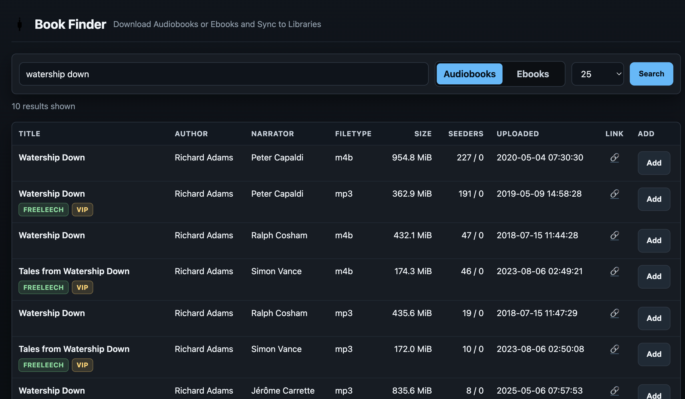
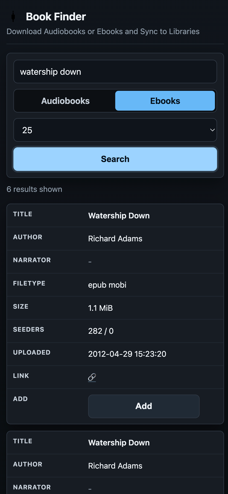

# MAM Book Finder

Lightweight web app and API for searching MyAnonamouse, sending downloads to Transmission, and copying completed books into audiobook and ebook libraries.

## Screenshots

| Desktop | Mobile |
| --- | --- |
|  |  |

## What It Does

- Search MAM for audiobooks and ebooks
- Add torrents to Transmission with a dedicated label
- Track download history
- Auto-import completed downloads into `/library` or `/ebooks`

## Requirements

- Docker and Docker Compose
- Transmission with RPC enabled
- A valid MAM session cookie
- Mounted host paths for `/data`, `/downloads`, `/library`, and `/ebooks`

## Quick Start

1. Set your MAM and Transmission settings in `docker-compose.yml`.
2. Mount your host storage to the in-container paths:
   - `/data` for the SQLite database
   - `/downloads` for Transmission downloads
   - `/library` for audiobooks
   - `/ebooks` for ebooks
3. Start the app:

   ```bash
   docker compose up -d --build
   ```

4. Open the UI at `http://localhost:8080`.

If you use Transmission in Docker, mount the same host downloads directory there too so completed paths resolve under `/downloads`.

## Configuration

Runtime config comes from environment variables in `docker-compose.yml`.

| Variable | Purpose |
| --- | --- |
| `MAM_COOKIE` | MAM session cookie |
| `TRANSMISSION_URL` | Transmission RPC URL |
| `TRANSMISSION_USER` | Transmission RPC username |
| `TRANSMISSION_PASS` | Transmission RPC password |


## Notes

- Search, add, and history are available from the main UI.
- The app has no authentication, so do not expose it directly to the public internet.

## License

MIT
